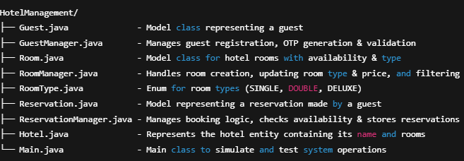
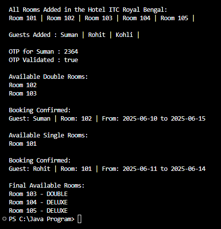

# INTRODUCTION
This Simple Hotel Management System is a Java-based project designed using Object-Oriented Principles and Low-Level Design (LLD). It manages core hotel operations like guest registration with OTP verification, room management (add/update), and reservation handling with room availability checks. Rooms are categorized by type (Single, Double, Deluxe), each with a specific capacity and pricing. The system ensures correct room allocation based on guest needs and prevents double-booking by tracking availability. It simulates a complete hotel workflow—from adding rooms and guests to confirming bookings—all with clean and maintainable code architecture.

# OBJECTIVE
The objectives of the Hotel Management System are to simplify the day-to-day operations of a hotel and ensure smooth handling of guest services and room reservations.
The project contains:

  1. Registering guests with OTP-based verification to ensure secure check-ins.
  2. Maintaining a proper list of all rooms along with their types, prices, and availability status.
  3. Allowing room booking based on availability and guest requirements, including group size and stay duration.
  4. Managing reservations efficiently by preventing double-booking and keeping track of all bookings made.
  5. Providing a clear and structured way to update room details and track guest information.

# FEATURES
Here are the features of the Simple Hotel Management System project:

🔹 Guest Management

* Add a new guest with name and phone number.
* Generate OTP for a guest's phone number.
* Validate OTP for secure verification.
* Maintain a list of all registered guests.

🔹 Room Management

* Add rooms with room number, type (Single, Double, Deluxe), and price.
* Update room type and price.
* Get a list of all rooms.
* Check availability of rooms.
* Filter rooms by specific `RoomType`.

🔹 Hotel Management

* Create a hotel with a name.
* Associate a list of rooms with the hotel.

🔹 Reservation Management

* Create reservations for guests.
* Check room availability for a given date range before booking.
* Store and retrieve all reservations.
* Prevent double-booking of the same room.

🔹 Booking Flow

* Guests verify identity with OTP before booking.
* Only available rooms matching the requested room type are shown.
* Booking is confirmed only if the room is available for the specified period.

🔹 Data Validation and Availability

* Validate guest details and OTP before confirming reservation.
* Automatically update room availability upon booking.


# PROJECT STRUCTURE


# OUTPUT


# 🛠️ How to Run

✅ Requirements :
- Java 8 or higher
- Command Line Terminal or IDE (e.g. VS Code, IntelliJ)

▶️ Run via Terminal :
Navigate to the folder containing HotelManagement/:
   ```bash
   cd path/to/Java

